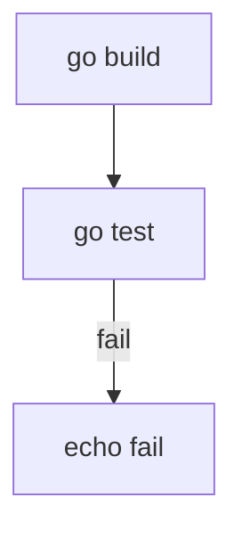

# runchart – プロジェクト概要

## 🎯 目的

`runchart` は、**Mermaidのflowchartを制御フロー定義として実行するGo製CLIツール**である。

これは：

* makeのような依存管理ツールではない
* ワークフローエンジンではない

runchartは：

> 制御フロー指向のCLIタスクランナー

である。

---

# 🧠 コア思想

1. 依存解決より制御フローを優先する
2. YAMLのネストより視覚的な流れを重視する
3. exit codeによる分岐を第一級機能とする
4. 軽量であること（永続化しない）
5. 実行状態が図と一致すること

---

# 🚫 明確な非目標（やらないこと）

runchartは以下を行わない：

* データベースを使用しない
* 実行状態を永続化しない
* 再起動復元をしない
* スケジューリングをしない
* 長時間ジョブ管理をしない
* ワークフローエンジン化しない
* ループをサポートしない（MVPはDAGのみ）

---

# 📐 入力仕様（MVP）

Mermaidの `flowchart` のみをサポートする。

例：



---

# 📋 MVP仕様

## フロー制限

* flowchartのみ対応
* DAGのみ（循環禁止）
* 単一開始ノード
* 並列実行なし（直列実行のみ）

---

## ノード定義

```
ID[command]
```

* ID：一意の識別子
* command：実行するシェルコマンド

---

## エッジ定義

### 通常エッジ

```
A --> B
```

exit code == 0 のときに遷移する。

---

### 条件付きエッジ

```
A -- fail --> B
```

exit code != 0 のときに遷移する。

---

# ⚙ 実行モデル

1. 開始ノード（入次数0）を検出する
2. ノードのコマンドを実行する
3. exit codeを取得する
4. 次ノードを決定する：

    * exit code == 0 → 通常エッジ
    * exit code != 0 → `fail`ラベル付きエッジ
5. 遷移先がなければ終了

並列処理は行わない。

---

# 🖥 CLI設計（初期）

基本コマンド：

```
runchart run flow.mmd
```

将来拡張候補：

```
runchart validate flow.mmd
runchart version
```

---

# 🧱 内部構成（高レベル）

モジュール分割：

* parser：Mermaid解析
* graph：内部グラフ構築
* validator：DAG検証
* executor：ノード実行
* cli：引数処理

---

# 📊 出力仕様（MVP）

例：

```
✔ build (1.2s)
✖ test (exit 1)
→ branching to notify
✔ notify (0.1s)
```

出力要件：

* ノードID表示
* 実行時間表示
* 失敗時はexit code表示
* 分岐先を明示

---

# 🛡 エラーハンドリング要件

* 構文エラーは行番号付きで表示
* 未定義ノード参照検出
* サイクル検出
* 開始ノードが複数ある場合のエラー
* fail分岐未定義時のエラー

---

# 🧪 テスト要件

### 単体テスト

* パーサ
* DAG検証
* 分岐ロジック

### 統合テスト

* 正常フロー
* fail分岐フロー

---

# 🏁 v0.1.0 完了条件

* 最小flowchartを解析できる
* DAG検証できる
* 直列実行できる
* exit code分岐できる
* 読みやすいCLI出力ができる

---

# 🔥 一文アイデンティティ

> runchartは、図をそのまま制御フローとして実行するCLIである。


