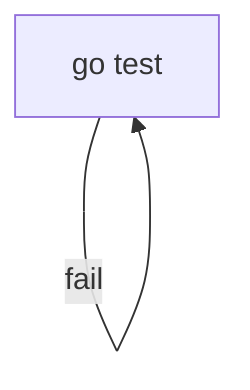

# runchart v0.2 仕様書

## 1. 目的

v0.2では、Mermaidのflowchartにおける**サイクル（ループ）を正式にサポート**する。

これにより：

* retryを自然な図として記述可能にする
* DAG制限を撤廃する
* 実行モデルを「グラフウォーカー」に変更する

---

## 2. 設計原則

1. Mermaid構文を拡張しない
2. 図の構造がそのまま制御構造である
3. 特別なretryノードは導入しない
4. ワークフローエンジン化しない
5. 永続化しない

---

## 3. 対応フロー仕様

### 3.1 サイクルを許可する

以下を有効とする：



* サイクルはエラーとしない
* DAG制約を撤廃する

---

## 4. 実行モデル変更

### 4.1 v0.1との違い

| v0.1      | v0.2   |
| --------- | ------ |
| DAG前提     | グラフ前提  |
| トポロジカル順実行 | 動的ウォーク |
| サイクル禁止    | サイクル許可 |

---

### 4.2 実行アルゴリズム（概念）

```
current = entryNode
steps = 0

while true:
    if steps >= maxSteps:
        abort with error

    execute current
    determine next node based on exit code

    if next == nil:
        break

    current = next
    steps++
```

---

## 5. 安全機構

### 5.1 最大ステップ数

CLIオプション：

```
--max-steps <int>
```

* デフォルト値：1000（暫定）
* 上限超過時はエラー終了

エラー例：

```
execution aborted: max steps (1000) exceeded
```

---

### 5.2 Ctrl+C対応

* SIGINT受信時に安全終了
* 現在ノードと実行履歴を表示

---

## 6. 分岐仕様拡張

### 6.1 exit codeベース分岐

ラベルが数値の場合：

```mermaid
A -- 1 --> B
A -- 2 --> C
```

* exit codeと一致したエッジを選択

---

### 6.2 default分岐

```mermaid
A -- default --> D
```

* 他の条件に一致しない場合に選択

---

### 6.3 優先順位

1. exit code完全一致
2. success（0）
3. fail（非0）
4. default
5. 遷移なし → 終了

---

## 7. validateコマンド再定義

```
runchart validate flow.mmd
```

### 検証内容

* 構文エラー
* 未定義ノード参照
* 開始ノード検出
* 到達不能ノード検出

※ サイクルはエラーにしない

---

## 8. ログ仕様

### 8.1 ループ時表示

例：

```
✔ test (0.8s)
✖ test (exit 1)
↺ loop to test
✔ test (0.7s)
```

* ループ遷移を明示する
* 必要に応じてステップ番号表示可

---

## 9. 非目標（v0.2でもやらない）

* 実行状態の永続化
* retry回数DSL
* ループ回数制限文法
* 並列実行
* スケジューリング
* Web UI
* 人間承認ノード

---

## 10. v0.2 完了条件

* Mermaid上で自然なループが実行可能
* サイクルを含むグラフがエラーにならない
* 無限ループをmax-stepsで防止できる
* 分岐がexit codeで細かく制御可能
* 図と実行ログが直感的に対応している

---

# v0.2 の一文アイデンティティ

> runchart v0.2 は、Mermaidのグラフをそのまま制御フローとして歩くCLIである。
